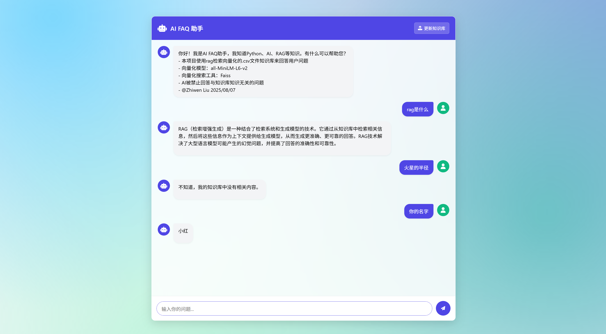

# FAQ Agent demo

## 概览：

## 功能：

这个FAQ RAG Agent是一个基于检索增强生成（Retrieval-Augmented Generation）技术的问答系统，能够根据上传的CSV文件数据回答用户问题。系统通过向量数据库存储和检索相关信息，结合大型语言模型生成准确的回答。

### 主要功能：

1. **问答功能** (`/ask`)
   - 接收用户问题并返回流式回答
   - 使用RAG技术从向量数据库中检索相关信息
   - 提供实时的流式响应，提升用户体验

2. **CSV文件管理**
   - **上传CSV文件** (`/upload-csv`): 上传包含FAQ数据的CSV文件并更新向量数据库
   - **删除CSV文件** (`/delete-csv`): 删除已上传的CSV文件并清理向量数据库

3. **向量数据库管理**
   - **重新加载向量数据库** (`/reload-vectordb`): 在需要时重新初始化和加载向量数据库

### 技术特点：

- 使用FastAPI构建高性能API服务
- 支持CORS，允许跨域请求
- 提供流式响应，实现实时问答体验
- 基于向量数据库的高效信息检索
- 结合大型语言模型生成自然、准确的回答

### API接口：

| 接口 | 方法 | 描述 |
|------|------|------|
| `/ask` | POST | 处理用户问题并返回流式回答 |
| `/upload-csv` | POST | 上传CSV文件并更新向量数据库 |
| `/delete-csv` | DELETE | 删除CSV文件并清理向量数据库 |
| `/reload-vectordb` | POST | 重新加载向量数据库 |